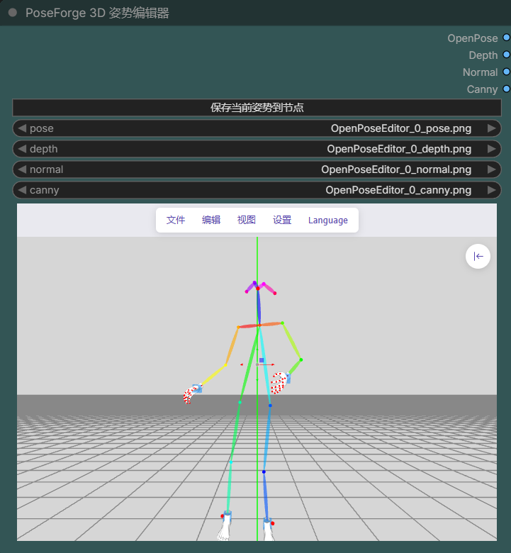
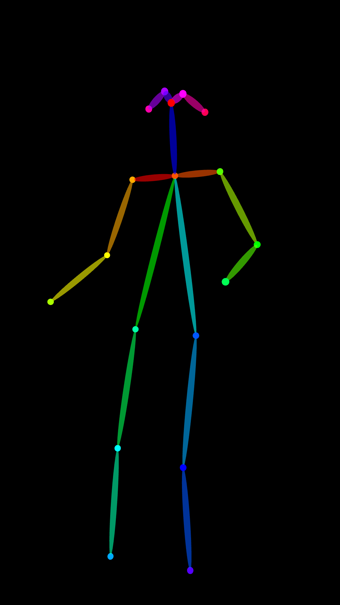
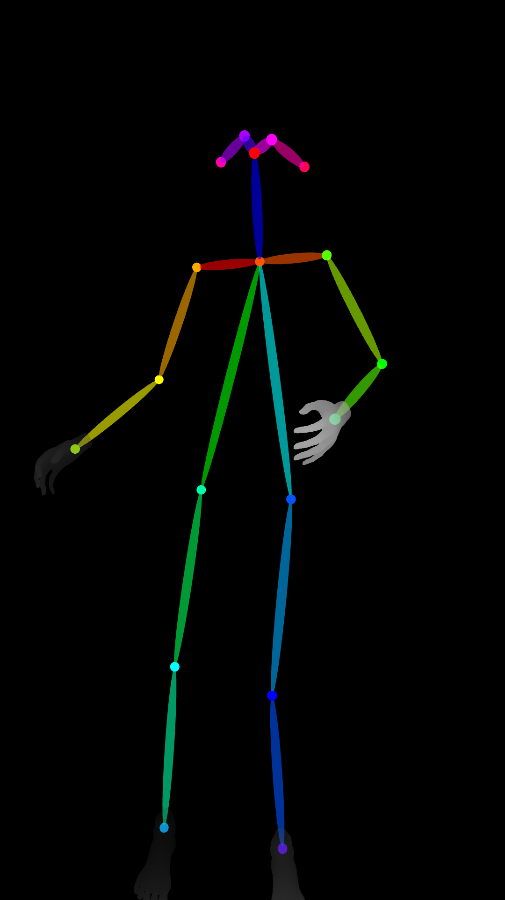
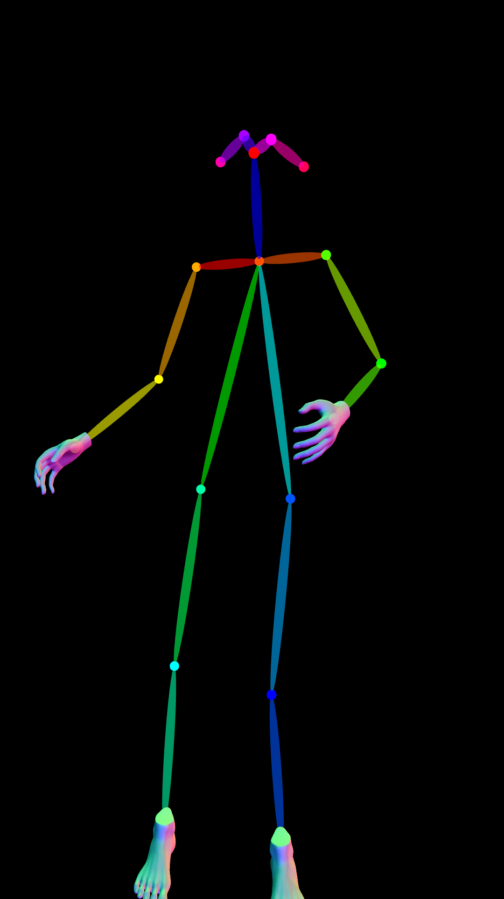
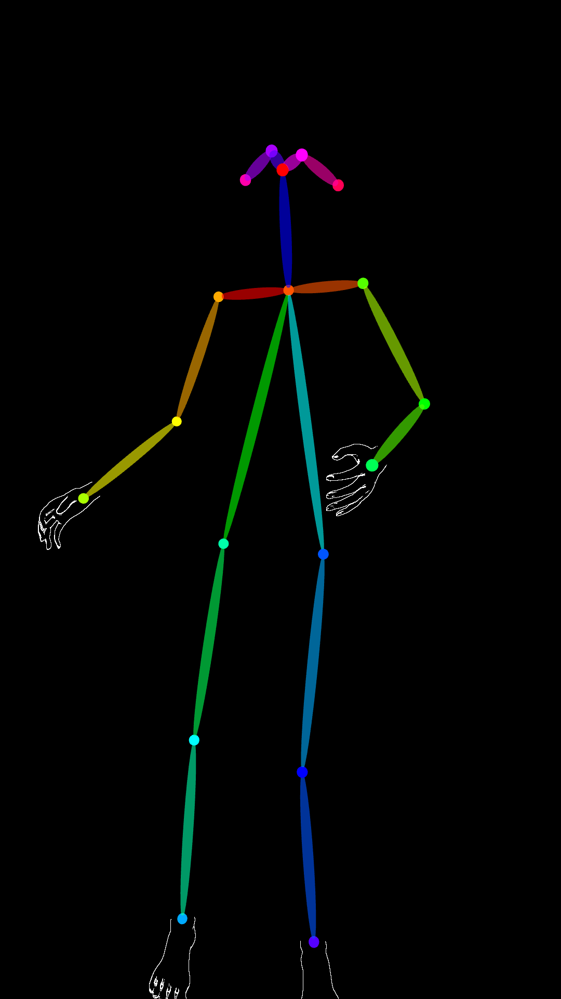

# PoseForge3D · ComfyUI 3D 姿势编辑器（增强版）

[](LICENSE)
[](https://github.com/comfyanonymous/ComfyUI)
[](https://github.com/hinablue/ComfyUI_3dPoseEditor)
[](#)

> 在 ComfyUI 节点内直接 **上传图片 → 自动识别 3D 人体骨骼 → 拖拽编辑姿势 → 一键输出 OpenPose / Depth / Normal / Canny 四张控制图**。
> 基于 Google MediaPipe BlazePose，33 个关键点、3D 空间、四肢骨长固定，编辑姿势不会把臂长、腿长拉变形。

本项目是 [hinablue/ComfyUI_3dPoseEditor](https://github.com/hinablue/ComfyUI_3dPoseEditor) 的**中文增强分支（fork）**，在原版基础上做了大量本地化与交互改进，并遵循原项目的 [MIT 协议](LICENSE) 开源。

---

## 目录

- [功能特性](#功能特性)
- [效果展示](#效果展示)
- [安装](#安装)
- [模型本地化（断网可用）](#模型本地化断网可用)
- [快速上手](#快速上手)
- [节点说明](#节点说明)
- [输出图说明](#输出图说明)
- [参数说明](#参数说明)
- [与原版的差异](#与原版的差异)
- [常见问题](#常见问题)
- [致谢](#致谢)
- [开源协议](#开源协议)

---

## 功能特性

- 🧍 **图片一键检测 3D 骨骼**：内置 MediaPipe BlazePose，上传单张人物图即可还原 33 个关键点的 3D 骨架，无需任何外部服务。
- 🦴 **骨长固定，编辑不变形**：肩、肘、腕、髋、膝、踝之间为刚性连接，拖动关键点只会旋转关节，不会改变正常的臂长、腿长。
- 🎛️ **节点内一体化编辑器**：菜单栏固定在节点内部顶部，3D 画布随节点缩放，不再悬浮于窗口。
- 🖼️ **一次输出四种控制图**：OpenPose、Depth（深度）、Normal（法线）、Canny（线稿），可直接接入对应 ControlNet。
- 🤚 **手脚专用渲染**：身体按 OpenPose 样式输出，手部 / 脚部分别按 Depth / Normal / Canny 渲染后合成，细节更清晰。
- 📐 **输出短边可调、自动保持原图比例**：手动设定短边像素，宽高比自动按原图计算，不再使用固定比例。
- 🔢 **参数支持手动输入整数**：所有滑块后的数字框可直接键入数值并回车提交。
- 💾 **仅在点击「保存当前姿势到节点」时出图**：编辑过程中不再频繁自动刷新、频闪黑屏。
- 🇨🇳 **默认中文界面、默认关闭缩略图、菜单默认收起**。
- 📦 **运行模型全部本地化**：MediaPipe 运行时与 hand / foot / data 资源固定放在插件目录，断网可用，不再每次重新下载。

## 效果展示

> 建议将截图放入 `docs/images/` 目录后替换下方链接。

| 编辑器界面 | OpenPose | Depth |
| :---: | :---: | :---: |
|  |  |  |

| Normal | Canny |
| :---: | :---: |
|  |  |

## 安装

### 方式一：ComfyUI Manager（推荐）

1. 打开 **ComfyUI Manager** → **Custom Nodes Manager**。
2. 搜索 `PoseForge3D`，点击 Install。
3. 重启 ComfyUI。

> 若本仓库尚未收录到 Manager 索引，可使用方式二。

### 方式二：手动安装

```bash
# 进入 ComfyUI 的 custom_nodes 目录
cd ComfyUI/custom_nodes

# 克隆本仓库（目录名必须为 ComfyUI-PoseForge3D）
git clone https://github.com/zoe40404/ComfyUI-PoseForge3D.git ComfyUI-PoseForge3D
```

随后重启 ComfyUI。Windows 便携版的 `custom_nodes` 路径一般为 `ComfyUI\custom_nodes\`。

> ⚠️ **目录名注意**：节点前端资源路径以目录名 `ComfyUI-PoseForge3D` 寻址，请勿随意重命名本地目录，否则编辑器将无法加载。

## 模型本地化（断网可用）

本分支已将编辑器所需的全部运行时资源固定在插件 `web` 目录中：

- MediaPipe 运行时（位于 `web/assets/mediapipe/`，共 8 个文件）：
  - `pose_solution_packed_assets_loader.js`
  - `pose_solution_packed_assets.data`
  - `pose_solution_wasm_bin.js` / `.wasm`
  - `pose_solution_simd_wasm_bin.js` / `.wasm`
  - `pose_web.binarypb`
  - `pose_landmark_full.tflite`
- 手部 / 脚部 / 姿态数据：`web/assets/hand-*.fbx`、`foot-*.fbx`、`data-*.bin`。

因此**无需联网下载、不会再弹出“正在下载 MediaPipe 姿势模型”**。

> 说明：MediaPipe 在浏览器（iframe）内运行，而 ComfyUI 的 `models` 目录没有 HTTP 路由、浏览器无法访问，因此浏览器端模型只能放在插件的 `web` 目录下（与原版 hand / foot 资源机制相同）。这与服务端模型（如 Depth、DWPose）存放位置不同。

## 快速上手

1. **添加节点**：右键菜单 → `PoseForge3D` → `PoseForge 3D 姿势编辑器`（或搜索 `PoseForge`）。
2. **上传图片**：节点顶部菜单选择 **文件 → 从图片检测（Detect From Image）**，选择一张人物图片。
3. **等待检测**：MediaPipe 自动在图上还原 3D 骨骼（检测时不会把原图留在画布中）。
4. **编辑姿势**：
   - 直接拖动关键点旋转关节（骨长保持不变）；
   - 空白处拖动可旋转视角，滚轮缩放；
   - 需要移动整个人体时，在 **设置** 中开启 Move Mode。
5. **保存出图**：点击节点顶部的 **「保存当前姿势到节点」** 按钮。
6. **获取结果**：节点的四个输出端口分别输出 OpenPose / Depth / Normal / Canny，接入 Preview Image 查看，或接入对应 ControlNet。

## 节点说明

- **节点类型名**：`PoseForge3D.PoseEditor`
- **节点显示名**：PoseForge 3D 姿势编辑器
- **所属分类**：`PoseForge3D`
- **输入控件（widgets）**：
  - `pose` / `depth` / `normal` / `canny`：对应四张已生成图片的文件名（由编辑器自动写入，一般无需手动选择）。
- **输出端口**：

| 端口 | 类型 | 含义 |
| :--- | :--- | :--- |
| OpenPose | IMAGE | OpenPose 风格骨骼图（含手脚合成） |
| Depth | IMAGE | 身体 OpenPose + 手脚 Depth 渲染 |
| Normal | IMAGE | 身体 OpenPose + 手脚 Normal 渲染 |
| Canny | IMAGE | 身体 OpenPose + 手脚 Canny 渲染 |

## 输出图说明

- 四张图的**身体躯干部分统一按 OpenPose 样式**渲染；
- **手部与脚部**则分别按照该端口对应的方式渲染：
  - OpenPose 端口 → 手脚为 OpenPose 样式；
  - Depth 端口 → 手脚为深度图样式；
  - Normal 端口 → 手脚为法线图样式；
  - Canny 端口 → 手脚为线稿样式。
- 在 **设置 → Only Hand（仅显示手）** 中：
  - **开启**：只输出手部，不输出脚部；
  - **关闭（默认）**：手部、脚部都输出。

## 参数说明

点击节点右上角齿轮（设置面板）可调整：

- **输出短边(像素,按原图比例)**：设定输出图短边长度，长边按原图宽高比自动计算（横图以高为短边，竖图以宽为短边）。
- **Width / Height**：输出宽高，整数，可直接在数字框键入。
- **Camera Near / Far / Focal Length**：相机近裁剪面、远裁剪面、焦距。
- **Body Parameters**：选中骨骼后可调整骨粗、头大小、肩宽、臂长、腿长、手脚尺寸等。

所有数字框均为**整数 / 小数手动输入**，键入后回车或失焦即提交。

## 与原版的差异

相对上游 [hinablue/ComfyUI_3dPoseEditor](https://github.com/hinablue/ComfyUI_3dPoseEditor)，本分支主要改动：

1. 新增节点顶部 **「保存当前姿势到节点」** 按钮，修复检测后自动保存发生在检测完成前、存入旧姿势的问题。
2. MediaPipe 运行时全套本地化，固定版本并从插件本地加载，断网可用。
3. 输出短边可调并自动保持原图比例；滑块数字框支持手动输入整数、回车提交。
4. Depth / Normal / Canny 三端按“身体 OpenPose + 手脚专用渲染”合成；支持 Only Hand 开关。
5. 修复编辑过程中**频闪黑屏**（场景状态恢复前置、原子化）。
6. 取消“松手自动出图”，仅在点击保存按钮时出图。
7. 默认中文、默认关闭缩略图、设置面板默认收起。
8. 菜单栏固定到节点内部顶部，画廊与设置按钮改为节点内定位；删除“反馈”菜单与“生成”按钮。
9. 节点、分类、仓库统一更名为 **PoseForge3D**。

## 常见问题

**Q：为什么不再每次重新下载 MediaPipe 模型？**
A：本分支已把运行时放到 `web/assets/mediapipe/` 并从本地加载，详见[模型本地化](#模型本地化断网可用)。

**Q：编辑时窗口频闪 / 黑屏？**
A：旧版本在自动出图过程中会插入黑清屏帧。本分支已将场景恢复逻辑前置并原子化，且改为仅手动保存时出图，如仍遇到请确认浏览器已 **Ctrl+Shift+R** 强制刷新、加载到最新 `main.js`。

**Q：更新插件后定制功能消失了？**
A：通过 Manager 更新会用官方版本覆盖 `main.js` / `openposeeditor.js`（`web/assets/mediapipe` 目录不受影响），此时需要重新应用本分支版本。

**Q：画布上旧节点变红 / 找不到？**
A：本分支节点类型名已由 `Hina.PoseEditor3D` 变更为 `PoseForge3D.PoseEditor`，请删除旧节点后重新添加。

## 致谢

- 原项目：[hinablue/ComfyUI_3dPoseEditor](https://github.com/hinablue/ComfyUI_3dPoseEditor)（作者 Hina Chen，MIT）。
- 编辑器基于：[ZhUyU1997/open-pose-editor](https://github.com/ZhUyU1997/open-pose-editor)。
- 姿态检测：[Google MediaPipe Pose](https://developers.google.com/mediapipe)。
- 运行平台：[ComfyUI](https://github.com/comfyanonymous/ComfyUI)。

感谢以上项目与作者的开源贡献。

## 开源协议

本项目遵循 [MIT 协议](LICENSE)，并保留原作者 Hina Chen 的版权声明：

```
Copyright (c) 2023 Hina Chen
Copyright (c) 2026 PoseForge3D Contributors
```
